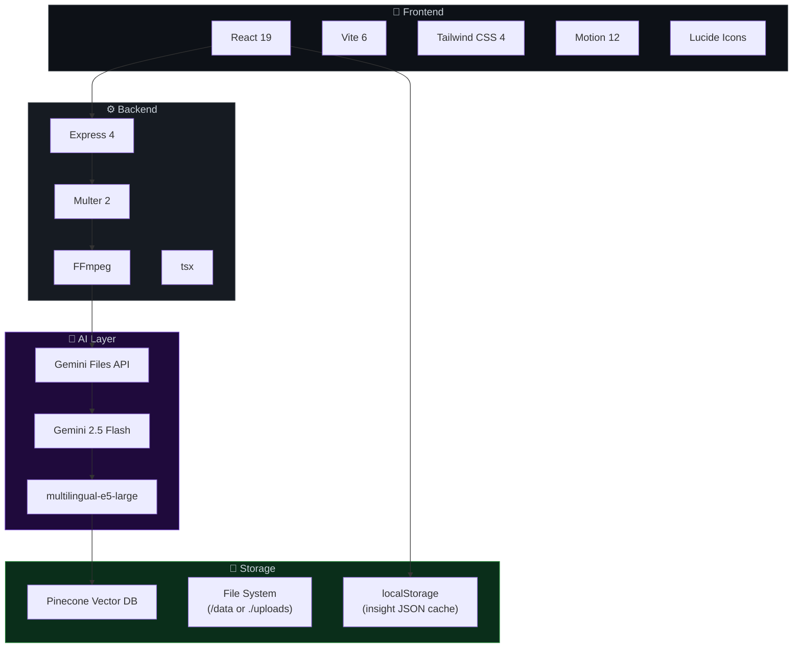
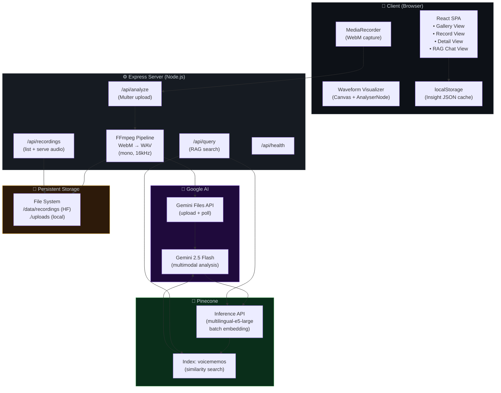
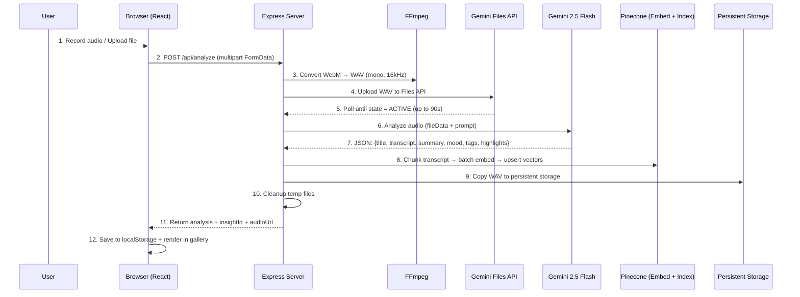
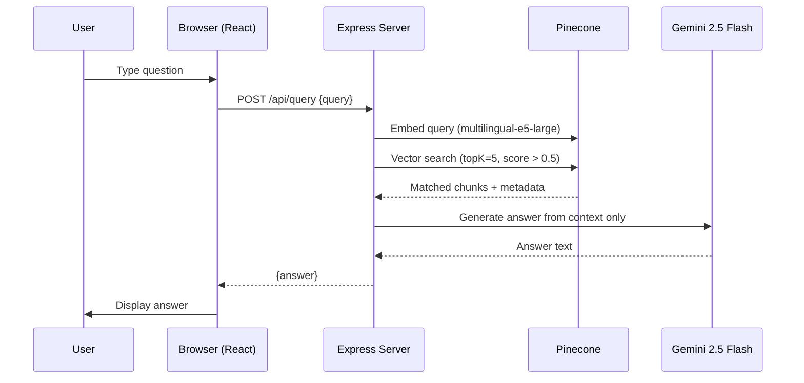

# Product Requirements Document (PRD)

## **The Insight Recorder** — AI-Powered Smart Voice Memo Platform

| Field | Detail |
|---|---|
| **Document Version** | 1.0 |
| **Date** | April 15, 2026 |
| **Product Stage** | Functional Prototype (deployed on Hugging Face Spaces) |
| **Author** | Vian C S Shah |

---

## Table of Contents

1. [Problem Statement](#1-problem-statement)
2. [Solution Overview](#2-solution-overview)
3. [Key Features](#3-key-features)
4. [Tech Stack](#4-tech-stack)
5. [System Architecture](#5-system-architecture)
6. [Data Flow & Processing Pipeline](#6-data-flow--processing-pipeline)
7. [Data Models](#7-data-models)
8. [API Surface](#8-api-surface)
9. [Target Users & Use Cases](#9-target-users--use-cases)
10. [Drawbacks & Limitations](#10-drawbacks--limitations)
11. [Future Roadmap](#11-future-roadmap)

---

## 1. Problem Statement

### The "Dead Data" Problem

Traditional voice recorders produce **dead data** — long, unstructured audio files that are rarely revisited because:

- **Finding information is tedious.** A 30-minute recording may contain only 2 minutes of truly actionable content, but the user must scrub through the entire file to find it.
- **No searchability.** Audio is inherently non-searchable. Users cannot Ctrl+F a voice memo.
- **No cross-referencing.** Insights captured across dozens of recordings are siloed. A user cannot ask "What were all the action items from last month?" without manually replaying every file.
- **Long-form fatigue.** Users stop recording altogether because the effort-to-value ratio is too high — capturing is easy, but retrieval is painful.

> [!IMPORTANT]
> **The core insight:** The act of recording is only valuable if the knowledge captured can be *retrieved and acted upon* effortlessly. Without intelligence layered on top, voice recordings are write-only storage.

### Who This Affects

| Persona | Pain Point |
|---|---|
| Corporate professionals | Meeting recordings pile up, action items never get extracted |
| Students & researchers | Lecture recordings are hours long; finding a specific concept is a needle-in-haystack problem |
| Content creators | Raw idea dumps never get revisited or repurposed |
| Personal journalers | Reflective thoughts are captured but never resurface |

---

## 2. Solution Overview

**The Insight Recorder** transforms passive voice recording into an **active knowledge-generation engine** by layering AI analysis, highlight extraction, and semantic search on top of every recording.

### Core Value Propositions

| Capability | How It Solves the Problem |
|---|---|
| **Auto-Distillation** | Every recording is analyzed by Gemini 2.5 Flash to extract a title, summary, transcript, mood, 5 tags, and 3 "Gold Nugget" highlights (~15s each) |
| **Semantic Search (RAG)** | Transcripts are embedded into a Pinecone vector database, enabling natural-language queries across the entire recording library — "What did I say about the product launch?" |
| **Silence Stripping & DSP** | A server-side FFmpeg pipeline + client-side DSP (noise gate, normalizer, compressor, silence stripper) cleans raw audio into tight, listenable clips |
| **Multilingual Support** | Handles English, Hindi, and Gujarati seamlessly — including code-switching common in Indian linguistic contexts |
| **Persistent Storage** | Audio files are saved to persistent storage (Hugging Face `/data` volume or local `./uploads`) for cross-session and cross-device access |

### Solution Diagram


---

## 3. Key Features

### Currently Implemented ✅

| Feature | Description |
|---|---|
| **Live Recording** | Browser-based recording via `MediaRecorder` API with real-time waveform visualization (Canvas + AnalyserNode) |
| **File Upload** | Accepts audio/video files (WebM, WAV, MP3, M4A, MP4) for processing |
| **Server-Side Audio Conversion** | FFmpeg converts WebM → WAV (mono, 16kHz) optimized for speech recognition |
| **Gemini Files API Integration** | Uploads audio to Google's Files API (supports up to 2GB), polls for processing completion, then runs multimodal analysis |
| **AI-Powered Analysis** | Extracts: title, transcript, summary, mood (calm/energetic/reflective), 5 tags, and 3 Gold Nugget highlights with timestamps |
| **Vector Embedding & Storage** | Transcripts are chunked (500 words, 50-word overlap), batch-embedded via Pinecone's `multilingual-e5-large` model, and upserted to a Pinecone index |
| **RAG Query Engine** | Natural-language questions are embedded, matched against stored vectors (top-5, score > 0.5), and answered by Gemini using only retrieved context |
| **Smart Gallery** | Mood-themed cards (gradient backgrounds shift by calm/energetic/reflective) with search, tag display, and highlight previews |
| **Snippet Playback** | Play specific Gold Nugget segments by seeking the audio to `startTime` and auto-stopping at `endTime` |
| **Persistent Audio Storage** | WAV files saved to server-side storage directory (HF `/data` or local `./uploads`) with API endpoints for listing and serving |
| **Health Check Endpoint** | Reports uptime, memory usage, storage path, and recording count |

### Not Yet Implemented ⏳

| Feature | Status |
|---|---|
| Pause / Resume recording | Designed, not implemented |
| Document generation (Email, MoM, Notes) | Planned for v4 |
| Recommendations & "Voice Note of the Day" | Planned for v3 |
| Speaker diarization | Future phase |
| Client-side DSP pipeline in browser | Code exists (`audioUtils.ts`) but is bypassed — all processing is server-side now |

---

## 4. Tech Stack

### 4.1 Frontend

| Technology | Version | Purpose |
|---|---|---|
| **React** | ^19.0.0 | UI component library |
| **Vite** | ^6.2.0 | Build tool and dev server (SPA mode, HMR) |
| **TypeScript** | ~5.8.2 | Type safety |
| **Tailwind CSS** | ^4.1.14 | Utility-first styling (via `@tailwindcss/vite` plugin) |
| **Motion** (Framer Motion) | ^12.23.24 | Animations — `AnimatePresence`, gestures, layout transitions |
| **Lucide React** | ^0.546.0 | Icon system (Mic, Play, Pause, Search, Send, etc.) |
| **Google Fonts** | — | Inter (body), JetBrains Mono (mono), Playfair Display (display headings) |

### 4.2 Backend

| Technology | Version | Purpose |
|---|---|---|
| **Node.js** | 20 (Alpine Docker) | Runtime |
| **Express** | ^4.21.2 | HTTP server, API routes, static file serving |
| **tsx** | ^4.21.0 | TypeScript execution (dev: `tsx server.ts`) |
| **Multer** | ^2.1.1 | Multipart file upload handling (audio files up to 250MB) |
| **FFmpeg** (`fluent-ffmpeg`) | ^2.1.3 | Audio conversion: WebM → WAV (mono, 16kHz) |
| **dotenv** | ^17.2.3 | Environment variable loading |

### 4.3 AI & Machine Learning

| Service / Model | Provider | Purpose |
|---|---|---|
| **Gemini 2.5 Flash** | Google AI | Multimodal audio analysis — transcription, summarization, mood detection, tag generation, highlight extraction |
| **Gemini Files API** | Google AI | Large file upload (up to 2GB), async processing with polling |
| **multilingual-e5-large** | Pinecone Inference | Text embedding model (1024 dimensions) for transcript chunks |
| **`@google/generative-ai`** | ^0.24.1 | Google Generative AI SDK for direct Gemini API calls |
| **`@google/generative-ai/server`** | — | `GoogleAIFileManager` for Files API upload, polling, and deletion |

### 4.4 Vector Database

| Service | Version | Purpose |
|---|---|---|
| **Pinecone** | ^7.2.0 (`@pinecone-database/pinecone`) | Vector storage and similarity search |
| **Index** | `voicememos` (configurable via `.env`) | Stores transcript chunk embeddings with metadata |

### 4.5 Infrastructure & Deployment

| Technology | Purpose |
|---|---|
| **Docker** (node:20-alpine) | Containerized deployment with FFmpeg pre-installed |
| **Hugging Face Spaces** | Hosting platform (Docker SDK, port 7860) |
| **Persistent Volume** (`/data/recordings`) | HF Spaces mounts `/data` for persistent audio storage |
| **docker-compose.yml** | Multi-service local dev (web + server) — partially configured |

### 4.6 Dependency Summary



---

## 5. System Architecture

### High-Level Architecture



### Server Startup Modes

| Mode | Trigger | Behavior |
|---|---|---|
| **Development** | `npm run dev` (no `NODE_ENV`) | Vite dev server middleware (HMR enabled), serves SPA via Vite |
| **Production** | `npm run start` (`NODE_ENV=production`) | Serves pre-built `dist/` as static files, Express handles API routes |

---

## 6. Data Flow & Processing Pipeline

### Recording → Insight Pipeline (Step-by-Step)



### RAG Query Pipeline



### Transcript Chunking Strategy

| Parameter | Value | Rationale |
|---|---|---|
| Chunk size | 500 words | Fits within embedding model context, preserves semantic meaning |
| Overlap | 50 words | Prevents information loss at chunk boundaries |
| Metadata per vector | title, summary, tags, audioUrl, timestamp, insightId, chunkIndex, text (truncated to 1000 chars) | Pinecone 40KB metadata limit enforcement |
| Batch upsert size | 100 vectors | Pinecone API recommended batch size |

---

## 7. Data Models

### `Insight` (Frontend TypeScript Interface)

```typescript
interface Insight {
  id: string;            // Generated: "ins-{timestamp}-{random6}"
  timestamp: number;     // Unix ms
  duration: number;      // Recording duration in seconds
  title: string;         // AI-generated (max 8 words)
  transcript: string;    // Full multilingual transcript
  summary: string;       // 2-3 sentence summary
  highlights: Highlight[];  // 3x Gold Nuggets
  mood: 'calm' | 'energetic' | 'reflective';
  audioUrl: string;      // Server path: /api/recordings/{id}.wav
  tags: string[];        // 5 auto-classified tags
}

interface Highlight {
  id: string;            // "h1", "h2", "h3"
  startTime: number;     // Seconds
  endTime: number;       // Seconds (~startTime + 15)
  text: string;          // Verbatim quote
  tag: '#Realization' | '#ActionItem' | '#Memory';
}
```

### Pinecone Vector Record

```typescript
{
  id: "ins-{timestamp}-{random}-c{chunkIndex}",
  values: number[],  // 1024-dimensional float array
  metadata: {
    title: string,
    summary: string,
    tags: string,          // Comma-separated
    audioUrl: string,
    timestamp: number,
    text: string,          // Chunk text (max 1000 chars)
    insightId: string,
    chunkIndex: number
  }
}
```

---

## 8. API Surface

| Endpoint | Method | Auth | Request | Response | Description |
|---|---|---|---|---|---|
| `/api/analyze` | POST | None | `multipart/form-data` with `audio` field (max 250MB) | `{ id, title, transcript, summary, mood, tags[], highlights[], audioUrl }` | Full processing pipeline: FFmpeg → Gemini → Pinecone |
| `/api/query` | POST | None | `{ query: string }` | `{ answer: string }` | RAG: embed → search → generate answer |
| `/api/recordings` | GET | None | — | `[{ id, filename, url, sizeMB, savedAt }]` | List all stored recordings (newest first) |
| `/api/recordings/:filename` | GET | None | — | Audio file (WAV) | Serve audio file with correct headers |
| `/api/health` | GET | None | — | `{ status, uptime, storagePath, recordingCount, memory }` | System health check |

---

## 9. Target Users & Use Cases

| Persona | Use Case | Key Feature Used |
|---|---|---|
| **Corporate Professionals** | Record meetings → extract MoM, action items, decisions | RAG Chat + Gold Nuggets (#ActionItem) |
| **Content Creators** | Capture raw ideas → get auto-trimmed, tagged snippets for repurposing | DSP Pipeline + Smart Gallery |
| **Students & Researchers** | Record lectures → query specific concepts across weeks of data | RAG ("What did the professor say about neural nets?") |
| **Personal Journalers** | Reflect via voice → browse mood-themed gallery of past thoughts | Mood Theming + Transcript Archive |
| **Multilingual Users** | Record in English/Hindi/Gujarati mix → get accurate transcription | Trilingual Gemini transcription |

---

## 10. Drawbacks & Limitations

### 🔴 Critical

| Drawback | Impact | Root Cause |
|---|---|---|
| **No Authentication / Authorization** | Anyone with the URL can access, query, and overwrite all recordings. Zero data privacy. | No auth layer implemented. HF Spaces are public by default. |
| **No Speaker Diarization** | In multi-person meetings, the system cannot distinguish "who said what." All speech is attributed as a single speaker. | Gemini 2.5 Flash does not natively return per-speaker labels. Requires a dedicated diarization model (e.g., pyannote). |
| **Single-Tenant Architecture** | All recordings are stored in one flat directory and one Pinecone index without user namespacing. Multiple users would overwrite each other's data. | No user model, no namespaced Pinecone, no per-user storage directories. |
| **No Offline Support** | The app is entirely server-dependent. No recording, playback, or querying works without an internet connection. | No service worker, no IndexedDB fallback, no PWA manifest. |

### 🟡 Significant

| Drawback | Impact | Root Cause |
|---|---|---|
| **High Processing Latency** | A 5-minute recording can take 30–60 seconds to process (FFmpeg + Gemini Files API upload + polling + analysis + embedding + upsert). User sees a long "Distilling Insights" spinner. | Sequential pipeline with network-bound steps. Gemini Files API polling alone can take up to 90 seconds. |
| **Gemini API Cost Dependency** | Every recording incurs Gemini API costs (audio tokens + text generation). At scale, costs grow linearly with recording count and length. | No caching, no local model fallback, no cost controls. |
| **Pinecone Free Tier Limits** | Free tier: 1 index, 100K vectors, limited queries/second. A heavy user with long recordings could exhaust this quickly (each recording produces multiple chunks). | Pinecone is the only vector store; no self-hosted fallback like ChromaDB or pgvector. |
| **No Data Export** | Users cannot export their recordings, transcripts, or insights. Data is locked into the platform. | No export API, no download-all feature. |
| **localStorage Fragility** | Insight metadata is cached in `localStorage`, which is browser-specific, limited to ~5MB, and wiped on cache clear. | No server-side insight persistence; the source of truth for insight *metadata* is the client browser, not the server. Pinecone stores vectors but not the full analysis JSON. |
| **Client-Side DSP is Bypassed** | The `audioUtils.ts` module (noise gate, normalizer, compressor, silence stripper) exists but is never called in the current flow. All audio goes raw to the server. | Migration to server-side FFmpeg + Gemini Files API made the client-side DSP pipeline redundant, but it was never removed. |

### 🟠 Moderate

| Drawback | Impact | Root Cause |
|---|---|---|
| **No Pause/Resume** | Users cannot pause and resume a recording. They must stop and start a new one. | `MediaRecorder.pause()` / `.resume()` are not wired up despite being designed in the implementation plan. |
| **WebM-Only Recording** | Browser `MediaRecorder` outputs WebM/Opus only. Server must convert to WAV before Gemini can process. | Browser API limitation; no client-side format negotiation. |
| **No Error Recovery / Retry** | If any pipeline step fails (FFmpeg, Gemini upload, Pinecone upsert), the entire recording is lost. No retry logic, no partial-save. | Pipeline is a monolithic try/catch. No checkpoint or saga pattern. |
| **No Real-Time Streaming** | RAG responses are not streamed. User waits for the full answer before seeing anything. | Uses `generateContent()` instead of streaming. No `useChat()` or `streamText()` integration. |
| **Highlight Timestamps May Be Inaccurate** | Gold Nugget `startTime` / `endTime` are Gemini's best guess and may not align precisely with the audio. | Gemini estimates timestamp positions from the audio; no forced-alignment or VAD verification. |
| **No Mobile Optimization** | Despite the `max-w-md` container suggesting mobile-first design, there is no PWA support, no haptic feedback, and no native mobile features. | Pure web app with no service worker, manifest, or platform-specific integrations. |
| **Hardcoded Embedding Model** | The Pinecone embedding model (`multilingual-e5-large`) is hardcoded. Changing models requires re-embedding all existing data. | No model versioning or migration strategy for the vector index. |

---

## 11. Future Roadmap

### Phase 1 (In Progress)

| Version | Features | Status |
|---|---|---|
| **v1** | Core recording, FFmpeg pipeline, Gemini analysis, Pinecone storage | ✅ Deployed |
| **v2** | RAG Chat, Smart Gallery, Snippet Playback | ✅ Deployed |
| **v3** | Recommendations, related tags, similar snippets, "Voice Note of the Day" | ⏳ Planned |
| **v4** | Document generation (Email, MoM, Personal Note, Talk Summary) | ⏳ Planned |

### Future Phases

| Feature | Description | Model / Tech |
|---|---|---|
| **Qwen2-Audio Integration** | End-to-end audio → embeddings without transcription step. Collapses the analysis + embedding pipeline. | Qwen2-Audio 7B (self-hosted, ~16GB VRAM) |
| **Speaker Diarization** | "Who spoke when" — critical for meeting recordings | pyannote / WhisperX |
| **Next.js Migration** | SSR, API routes, file-based routing for production readiness | Next.js 15 (App Router) |
| **Vercel AI SDK** | Provider-agnostic AI layer — swap Gemini for Claude, GPT, or Qwen with a one-line change | `ai` + `@ai-sdk/google` |
| **Cloud Audio Storage** | Firebase/S3 for reliable, CDN-backed audio persistence | Firebase Storage / AWS S3 |
| **User Authentication** | Multi-tenant support, per-user Pinecone namespaces, private recordings | NextAuth / Clerk |

---

> [!NOTE]
> This PRD reflects the **current state of the deployed codebase** as of April 2026. The implementation plan (`implementation_plan.md`) contains a more aspirational architecture (Next.js, Vercel AI SDK) that has not yet been implemented. This document distinguishes between what *is built* and what *is planned*.
