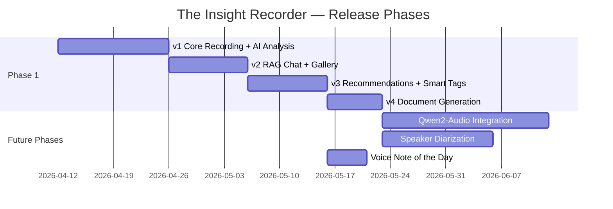
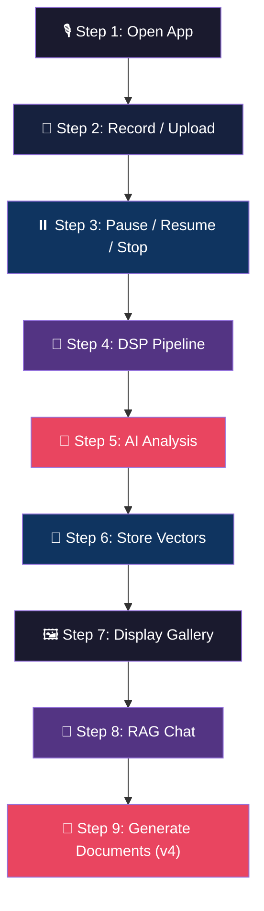
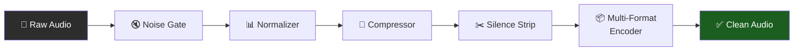
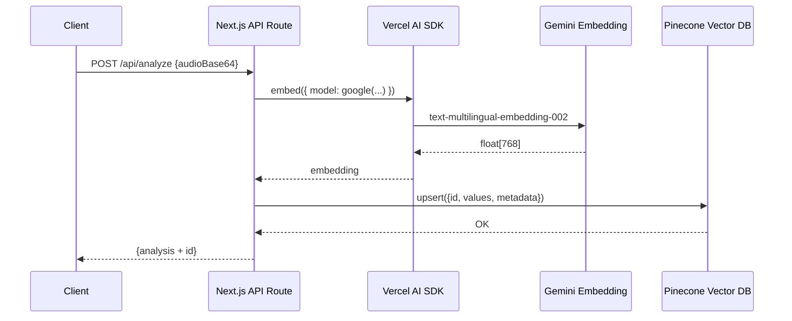
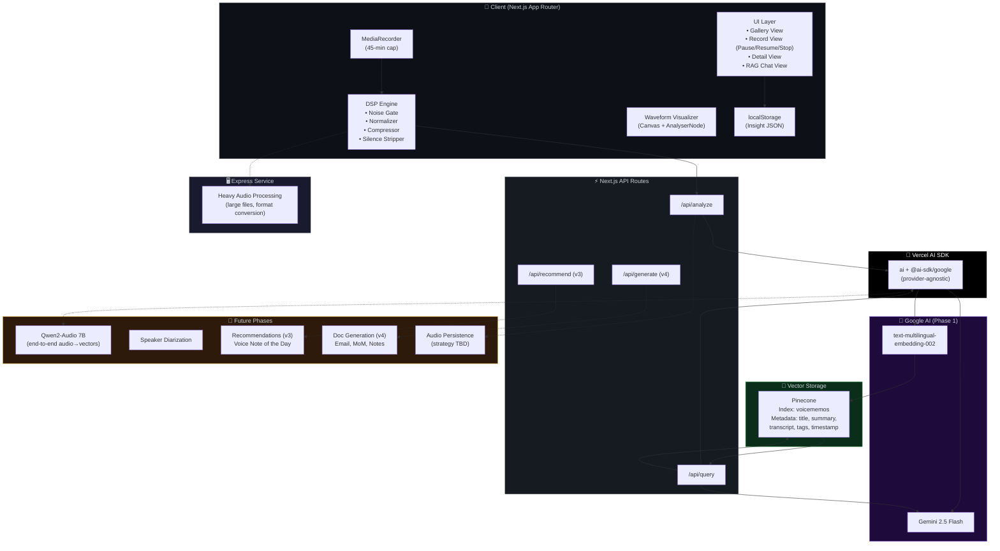

# The Insight Recorder — System Architecture (Revised)

> Incorporating all feedback. Changes from v1 marked with 🔄.

---

## 1. Phased Roadmap



| Phase | Version | Features | AI Models |
|---|---|---|---|
| **Phase 1** | v1 | Record/Upload, DSP Pipeline, AI Analysis, Vector Storage | Gemini 2.5 Flash + `text-multilingual-embedding-002` |
| **Phase 1** | v2 | RAG Chat, Smart Gallery, Snippet Playback | Same |
| **Phase 1** | v3 | Related tags, similar snippets, recommendations | Same |
| **Phase 1** | v4 | Document Generation (Email, MoM, Notes, Summary) | Same |
| **Future** | — | Qwen2-Audio (end-to-end audio→embeddings), Speaker Diarization, Voice Note of the Day | Qwen2-Audio 7B |

---

## 2. Tech Stack (🔄 Revised)

### Before → After

| Layer | Before | After | Reason |
|---|---|---|---|
| **Frontend Framework** | Vite + React SPA | 🔄 **Next.js** (App Router) | SSR, API routes, file-based routing, production-ready |
| **Backend** | Express (embedded with Vite) | 🔄 **Next.js API Routes + Express** | Express for heavy audio processing; API routes for lightweight endpoints |
| **AI SDK** | `@google/generative-ai` (Google-only) | 🔄 **Vercel AI SDK (`ai`)** with `@ai-sdk/google` provider | Provider-agnostic — swap to Anthropic, OpenAI, or Qwen later without code changes |
| **Styling** | Tailwind CSS v4 | Tailwind CSS v4 (unchanged) | — |
| **Animations** | `motion` (Framer Motion) | `motion` (unchanged) | — |
| **Icons** | `lucide-react` | `lucide-react` (unchanged) | — |

### 🔄 Updated Dependency Map

#### Runtime Dependencies

| Package | Version | Layer | Purpose |
|---|---|---|---|
| `next` | ^15.x | Fullstack | Framework — SSR, API routes, routing |
| `react` | ^19.0.0 | Frontend | UI components |
| `react-dom` | ^19.0.0 | Frontend | DOM rendering |
| `ai` | ^4.x | Backend | 🔄 **Vercel AI SDK** — unified interface for any LLM |
| `@ai-sdk/google` | ^1.x | Backend | 🔄 **Google provider** for Vercel AI SDK (Gemini models) |
| `@pinecone-database/pinecone` | ^7.2.0 | Backend | Vector database client |
| `express` | ^4.21.2 | Backend | Separate service for heavy audio processing |
| `motion` | ^12.23.24 | Frontend | Animations (AnimatePresence, gestures) |
| `lucide-react` | ^0.546.0 | Frontend | Icon system |

#### Dev Dependencies

| Package | Version | Purpose |
|---|---|---|
| `tailwindcss` | ^4.1.14 | Utility-first CSS |
| `@tailwindcss/postcss` | ^4.x | PostCSS plugin for Next.js |
| `typescript` | ~5.8.2 | Type checking |
| `@types/node` | ^22.x | Node.js type defs |
| `@types/express` | ^4.x | Express type defs |

> [!IMPORTANT]
> **Removed**: `vite`, `@vitejs/plugin-react`, `@tailwindcss/vite`, `tsx`, `@google/generative-ai`, `@google/genai` — all replaced by the Next.js + Vercel AI SDK stack.

---

## 3. User Flow → Technical Component Mapping



---

### Step 1 — User Opens the App

| Aspect | Detail |
|---|---|
| **Route** | `/` → Next.js App Router page |
| **Default View** | Gallery — list of past insights |
| **Data Loaded** | `localStorage` (Phase 1) → Cloud DB (Future) |
| **Components** | `<InsightCard>`, Search bar, Bottom controls |

---

### Step 2 — Record Voice / Upload File

| Aspect | Detail |
|---|---|
| **Record API** | `navigator.mediaDevices.getUserMedia({ audio: true })` → `MediaRecorder` |
| **Upload** | `<input type="file" accept=".m4a,.mp3,.mp4,.wav,.webm,audio/*,video/*">` |
| **Accepted Formats** | WAV, MP3, M4A (AAC/MPEG-4/Apple), MP4, WebM |
| **Live Visualization** | `<Waveform>` component — `AnalyserNode` → Canvas |
| **🔄 Recording Limit** | **45 minutes maximum** — auto-stop with warning at 40 min |

---

### 🔄 Step 3 — Pause / Resume / Stop

The recording view now shows **three controls** instead of just a stop button:

```
┌─────────────────────────────────┐
│        2:34 Recording...        │
│                                 │
│    ┌──────┐  ┌──────┐          │
│    │  ⏸️  │  │  ⏹️  │          │
│    │Pause │  │ Stop │          │
│    └──────┘  └──────┘          │
│                                 │
│    ~~~~~~~~ Waveform ~~~~~~~~   │
└─────────────────────────────────┘

     When paused:
┌─────────────────────────────────┐
│     2:34 Paused (blinking)      │
│                                 │
│    ┌──────┐  ┌──────┐          │
│    │  ▶️  │  │  ⏹️  │          │
│    │Resume│  │ Stop │          │
│    └──────┘  └──────┘          │
└─────────────────────────────────┘
```

| Action | Implementation |
|---|---|
| **Pause** | `mediaRecorder.pause()` — timer pauses, waveform freezes, "Paused" label blinks |
| **Resume** | `mediaRecorder.resume()` — timer resumes, waveform reactivates |
| **Stop** | `mediaRecorder.stop()` → trigger DSP pipeline |
| **Auto-stop** | At 45 min: `mediaRecorder.stop()` + toast "Maximum recording length reached" |
| **Warning** | At 40 min: subtle pulse on timer + "5 minutes remaining" badge |

---

### Step 4 — DSP Pipeline (Client-Side Audio Processing)

🔄 **Plain-language explanation of what each stage does:**



| DSP Stage | What It Does (Plain Language) | How It Works | Parameters |
|---|---|---|---|
| **🔇 Noise Gate** | **Kills background hum.** If you're recording in a room with AC, fan noise, or low-level static, the noise gate detects any sound below a "noise floor" and zeroes it out — making the silent parts truly silent. | Samples below `noiseFloor` amplitude → set to 0 | `noiseFloor = 0.01` |
| **📊 Normalizer** | **Makes quiet recordings loud.** If someone spoke softly, the whole recording gets boosted so the loudest part hits 90% volume. This ensures every recording *feels* the same loudness regardless of mic distance. | Find peak sample → calculate `gain = 0.9/peak` → multiply all samples | Target peak: `0.9` |
| **🔧 Soft Compressor** | **Prevents clipping/distortion.** After normalization, some peaks might be too hot. The compressor gently squashes anything above 0.8 — keeping it loud but not distorted. Think of it as a "volume ceiling." | Samples > 0.8 → reduced by 80% of the excess | Threshold: `0.8`, Ratio: `5:1` |
| **✂️ Silence Stripper** | **Removes dead air.** Any gap of silence longer than 0.4 seconds gets cut out. This turns a 10-minute recording with lots of pauses into a tight 6-minute clip of pure speech. A tiny 0.15s pad is kept so words don't sound chopped. | Detect speech segments → stitch together, dropping gaps > `minSilenceDuration` | Gap threshold: `0.4s`, Padding: `0.15s` |

#### 🔄 Multi-Format Audio Encoding

The proposal specifies accepting **and outputting** multiple formats — not just WAV:

| Format | Extension | Codec | Use Case |
|---|---|---|---|
| **WAV** | `.wav` | PCM 16-bit | Lossless — sent to Gemini for analysis (highest quality) |
| **MP3** | `.mp3` | MPEG Layer 3 | Sharing — small file size for export/download |
| **AAC/M4A** | `.m4a` | AAC (MPEG-4) | iPhone compatibility — Apple's native voice memo format |
| **MP4** | `.mp4` | AAC audio track | Video container — for audio-only MP4 from iPhone screen recordings |
| **WebM** | `.webm` | Opus | Browser recording default — what `MediaRecorder` produces |

**Processing strategy**: 
- **Internal pipeline** always processes in WAV (PCM) for DSP accuracy
- **API submission** sends WAV to Gemini (best quality for transcription)
- **Storage/Export** can encode to M4A/MP3 for smaller file sizes
- **Input decoding**: All formats are decoded via `AudioContext.decodeAudioData()` which handles MP3, M4A, MP4, WAV, and WebM natively in modern browsers

> [!NOTE]
> For **encoding to MP3/M4A** on the client side, we'd need a library like `lamejs` (MP3) or use the `MediaRecorder` API with specific codec options. Alternatively, encoding can happen server-side via FFmpeg on the Express service.

---

### Step 5 — AI Analysis (Vercel AI SDK + Gemini)

🔄 **Now using the Vercel AI SDK** instead of the raw Google SDK:

```typescript
// Before (Google SDK — tightly coupled)
import { GoogleGenerativeAI } from "@google/generative-ai";
const genAI = new GoogleGenerativeAI(process.env.GEMINI_API_KEY);
const model = genAI.getGenerativeModel({ model: "gemini-2.5-flash" });

// After (Vercel AI SDK — provider-agnostic)
import { generateText, embed } from "ai";
import { google } from "@ai-sdk/google";

const result = await generateText({
  model: google("gemini-2.5-flash"),  // ← Swap to openai("gpt-4o") or any provider later
  messages: [{ role: "user", content: [...] }],
});
```

**Why this matters**: If you later want to test Anthropic Claude, OpenAI, or Qwen — it's a **one-line model swap**, not a full SDK migration.

| Aspect | Detail |
|---|---|
| **SDK** | 🔄 Vercel AI SDK (`ai` + `@ai-sdk/google`) |
| **Model** | `google("gemini-2.5-flash")` — multimodal, accepts audio inline |
| **Input** | Base64 audio + structured JSON prompt |
| **Output** | `{ title, transcript, summary, mood, tags[5], highlights[3] }` |

> [!TIP]
> The Vercel AI SDK also provides `useChat()` and `streamText()` React hooks — which will make the RAG Chat view much cleaner to implement with streaming responses.

---

### Step 6 — Vector Storage (Pinecone)



| Aspect | Detail |
|---|---|
| **Embedding Model** | `text-multilingual-embedding-002` (768 dimensions) |
| **Vector DB** | Pinecone (`@pinecone-database/pinecone` ^7.2.0) |
| **Index Name** | `voicememos` (from `.env`) |
| **🔄 Metadata Stored** | `{ title, summary, transcript, tags, timestamp }` |
| **ID Strategy** | `Math.random().toString(36).substr(2, 9)` |

> [!IMPORTANT]
> 🔄 **`tags` added to metadata** — enables filtered vector search like "show me all #ActionItem recordings" without full-text scanning.

---

### Step 7 — Smart Gallery Display

| Aspect | Detail |
|---|---|
| **Route** | `/` — default page |
| **Search** | Client-side filter on `title`, `transcript`, `tags` |
| **Detail View** | Click card → full transcript, summary, Gold Nuggets, snippet playback |
| **Mood Theming** | Background gradient shifts by mood |

---

### Step 8 — RAG Chat (Phase 1 Pipeline — Confirmed ✅)


🔄 With Vercel AI SDK, the RAG chat can use `streamText()` + the `useChat()` React hook for real-time streaming responses instead of waiting for the full answer.

---

### Step 9 — Document Generation (Phase 1 v4)

Deferred to **Phase 1 Version 4**. Will add a `POST /api/generate` endpoint:

| Output Type | Prompt Strategy |
|---|---|
| **Email** | "Convert this transcript into a professional email..." |
| **Minutes of Meeting** | "Extract attendees, agenda, decisions, action items..." |
| **Personal Note** | "Rewrite as a personal journal entry..." |
| **Talk Summary** | "Create an executive summary with key takeaways..." |

---

## 4. AI Models — Phase Plan

### Phase 1 (Current) ✅

| Model | Provider | Via | Used For |
|---|---|---|---|
| `gemini-2.5-flash` | Google | Vercel AI SDK (`@ai-sdk/google`) | Transcription, summarization, highlights, mood/tag classification, RAG answers, doc generation (v4) |
| `text-multilingual-embedding-002` | Google | Vercel AI SDK (`@ai-sdk/google`) | 768-dim text embeddings for Pinecone |

### Future Phases — Qwen2-Audio

| Model | Provider | Used For |
|---|---|---|
| `Qwen2-Audio-7B` | Self-hosted (HuggingFace Transformers) | **End-to-end audio understanding** — skips transcription, generates embeddings directly from audio waveforms |

> [!NOTE]
> **Qwen2-Audio** can understand audio natively without needing transcription first. This would collapse Steps 5+6 into a single pass: `raw audio → Qwen2-Audio → embeddings + analysis`. This is a significant architecture simplification but requires GPU hosting infrastructure.
>
> **Open question below** about hosting strategy for this model.

---

## 5. Data Models (🔄 Updated)

### Core TypeScript Interfaces

```typescript
interface Insight {
  id: string;               // From Pinecone upsert
  timestamp: number;         // Unix ms
  duration: number;          // Seconds
  title: string;             // AI-generated
  transcript: string;        // Full multilingual transcript (EN/HI/GU)
  summary: string;           // Executive summary
  highlights: Highlight[];   // 3x Gold Nuggets (15s each)
  mood: 'calm' | 'energetic' | 'reflective';
  audioUrl: string;          // ⚠️ Storage strategy TBD (see Open Questions)
  tags: string[];            // 5 auto-classified tags
}

interface Highlight {
  id: string;
  startTime: number;         // Seconds
  endTime: number;           // Seconds (~startTime + 15)
  text: string;              // Gold nugget quote
  tag: '#Realization' | '#ActionItem' | '#Memory';
}
```

### 🔄 Pinecone Vector Record (tags added)

```typescript
{
  id: string,
  values: number[],              // 768-dim float32
  metadata: {
    title: string,
    summary: string,
    transcript: string,
    tags: string[],              // 🔄 NEW — enables filtered search
    timestamp: number
  }
}
```

---

## 6. API Routes (Next.js App Router)

| Route | Method | Phase | Purpose |
|---|---|---|---|
| `/api/analyze` | POST | v1 | Audio → DSP → Gemini analysis → Pinecone upsert |
| `/api/query` | POST | v2 | RAG: embed question → Pinecone search → Gemini answer |
| `/api/generate` | POST | v4 | Transform insight into email/MoM/note/summary |
| `/api/recommend` | GET | v3 | Related tags, similar snippets |

---

## 7. Full System Architecture



---

## 8. Open Questions (Need Your Input)

> [!IMPORTANT]
> ### Q1: Audio File Storage Strategy
> You asked: *"Can't we save audio files in the same path as OS voice recorder apps?"*
>
> On the **web**, browsers sandbox all file access — you cannot write to the phone's Voice Memos folder. Three options:
>
> | Option | Pros | Cons |
> |---|---|---|
> | **A) Cloud Storage** (Firebase/S3) | Works everywhere, persistent, shareable URLs | Requires backend, costs at scale |
> | **B) PWA + File System Access API** | Writes to user-chosen folder, no server needed | Limited iOS support, user must grant permission each time |
> | **C) Native shell** (Capacitor/React Native) | Full OS-level file access, can write to Voice Memos | Requires app store deployment, separate codebase |
>
> Which approach fits your product vision?

> [!IMPORTANT]
> ### Q2: Qwen2-Audio Hosting (Future Phase)
> Qwen2-Audio-7B requires **~16GB VRAM** for inference. Options:
>
> | Option | Cost | Latency | Integration |
> |---|---|---|---|
> | **A) Self-hosted GPU VM** (RunPod/Lambda) | ~$0.50/hr | Low | Custom API endpoint → Vercel AI SDK custom provider |
> | **B) HuggingFace Inference Endpoints** | Pay-per-request | Medium | HuggingFace API → Vercel AI SDK |
> | **C) Local GPU** (if you have one) | Free | Lowest | Direct Python process |
>
> Which direction for future phase infra?

> [!IMPORTANT]
> ### Q3: Next.js ↔ Express Architecture
> Two patterns for combining Next.js + Express:
>
> | Pattern | Description |
> |---|---|
> | **A) Unified** | Next.js handles everything. Custom Express server wraps Next.js (one deployment). Heavy audio processing in Next.js API routes with streaming. |
> | **B) Split** | Next.js = frontend + lightweight API routes. Express = separate microservice for audio processing (two deployments). |
>
> Pattern A is simpler to deploy. Pattern B scales better if audio processing gets heavy. Which do you prefer?
